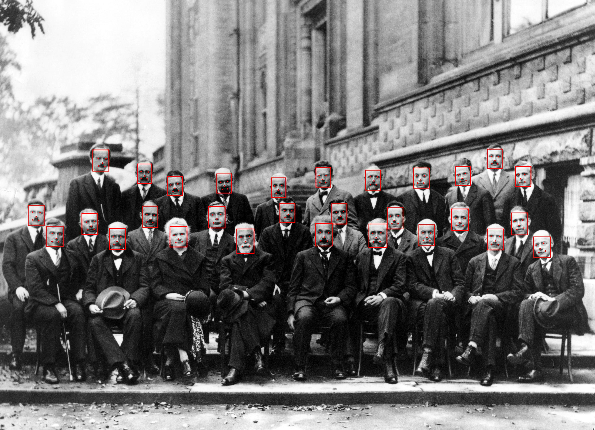

# SCRFD

```py
from scrfd import SCRFD, Threshold
from PIL import Image

face_detector = SCRFD.from_path("./models/scrfd.onnx")
image = Image.open("./images/solvay_conference_1927.jpg")

threshold = Threshold(probability=0.4)
faces = face_detector.detect(image, threshold=threshold)

for face in faces:
    bbox = face.bbox
    kps = face.keypoints
    score = face.probability
    print(f"{bbox=}, {kps=}, {score=}")
```


